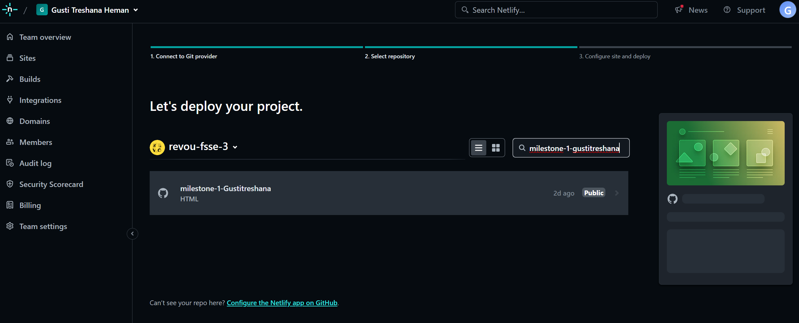

[](https://classroom.github.com/a/_e9whi2b)

# How To Set Up & Run The Project
---
## Set Up Visual Code Studio
1. Open code Visual Code Studio.
2. Open folder.

3. After folder opened, create a new file or folder. Example: I create file index.html in root folder, style.css inside new folder "CSS" and script.JS inside "JS" Folder.

4. Connect file style.css to HTML.
```
<link rel="stylesheet" href="CSS/style.css">
```

5. Connect file script.js to HMTL.
```
<script src="JS/script.js"></script>
```

6. Now you can start writting code in HMTL, CSS, JS.

---
## Explain The Design
1. This is for example, I will explain the navbar and header design.

2. This is my HMTL for the design.


In this HTML I use several class in tag element for styling in CSS. I use tag div to wrap an element for stlying in CSS.
3. This is my CSS for the design.


On this picture above, for example I use property:
* display: flex; to adjust position several element in container or wrapper for make them in row position or column position.
* justify-content and align-item property is for make them in center of container or space-evenly etc.

In this picture above, for example I use property:
* cursor: pointer; This is for make cursor change to pointer when cursor hover on element like Button.
* Transition: all .5s ease-in-out; This is for make an element have a transition like change color from blue and then when cursor hover on button, the button change color to white.

In this picture above, for an example I use keyframes for make an animation to change color from white-blue-white like flashing on button. This is can run automaticaly without hover the cursor, It can be run infinite.

4. For further information about HMTL and CSS, you can visit the link https://www.w3schools.com/
---
## How To Use External Font
1. I use google font, you can open https://fonts.google.com/
2. I use font "Inter" for my project.

3. Cick Download Family.
4. After download the font, you can extract and you will see folder static.

5. In this project, I move static folder to folder assets inside folder milestone-1-gustitreshana.

6. In file style.css you can use @font-face.'


---
# Netlify Registration and Deployment with Cloudflare Domain Connection

---

## Introduction

This tutorial guides you through the process on registering on Netlify an the steps fo feploying a project. Netlify is a platform that simplifies hosting and automation fo web-based sites and applications.

---

## Table of Conntent
- Introduction
- Table of content
- Netlify Registration
- Creating a New Project
- Deploying Your Project
- Connecting Netlify with Cloudflare
- Conclusion

---

## Netlify Registration

Follow these steps to register on Netlify:

1. Visit the Netlify website (https://www.netlify.com)


2. Click the **Sign up** button in the top right corner.


3. You can register using your e-mail or through a GitHub, GitLab, Bitbucket account, or Sign Up with e-mail.


4. Follow the provided registration process, including e-mail verivication if required.

---

## Creating a New Project

To create a new project on Netlify, follow these steps:

1. After logging in, on Netlify dashboard, click **Site** and choose **Import from Git**.


2. Choose the Git provider where your repository is located (Github, GitLab, Bitbucket).


3. Select the repository you want to deploy.


4. Configure your build settings as needed for your project (for example, Base directory and publish directory).


5. Click **Deploy**


---

## Deploying Your Project

Once of your project is set up, each time you push change to your repository, Netlify will automatically deploy the latest version of your site. You can also manually trigger a deploy from the dashboard if needed.

---

## Connecting Netlify with Cloudflare

1. Go to [Cloudflare](https://www.cloudflare.com/) and log in to your account.


2. In Cloudflare, add the domain you want to connect to your Netlify site.


3. Select your plan


4. Continue follow the instructions


5. Update Nameserver from Cloudflare at Niagahoster


6. Wait until Nameserver updated


7. Netlify DNS and Cloudflare Nameserver updated!


---

## Colclusion

Using Netlify, the process of the hosting and deploying websites becomes more straightforward and efficient. The platform is very useful for the webdevelopers to speed up deployment processes and integration with various VCS (Version Control System) Services.

Congratulations! You have successfully registered on Netlify, deployed a site, and connected your domain with Cloudflare. Your website should now be accessible via your custom domain, with the added performance and security benefits of Cloudflare.

---

This tutorial was compiled by [Gusti Treshana Herman]. For more information and detailed guides, visit the Netlify Websites (https://www.netlify.com).


